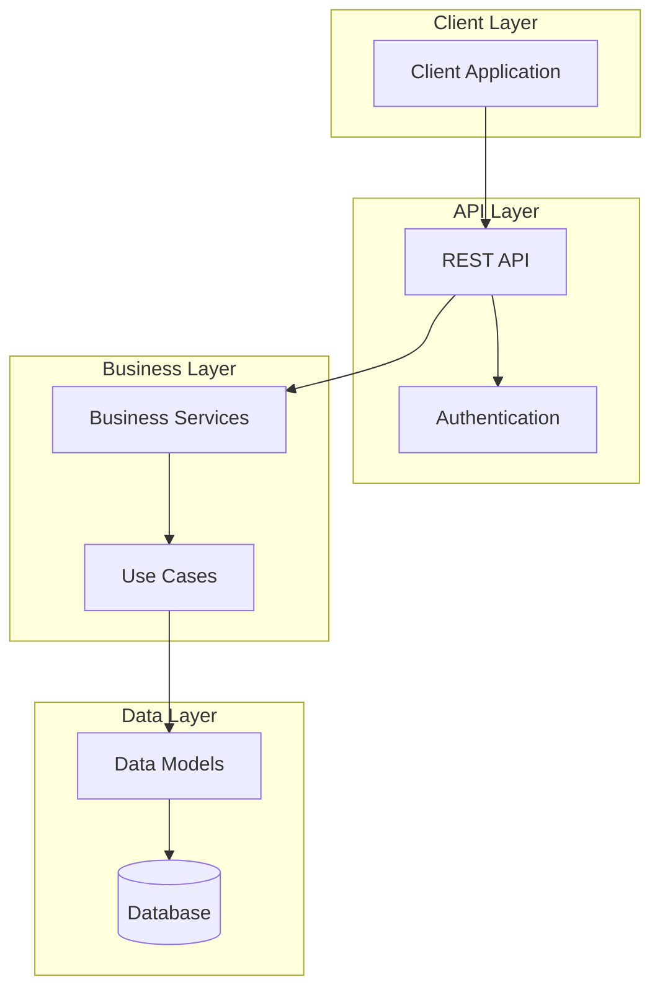
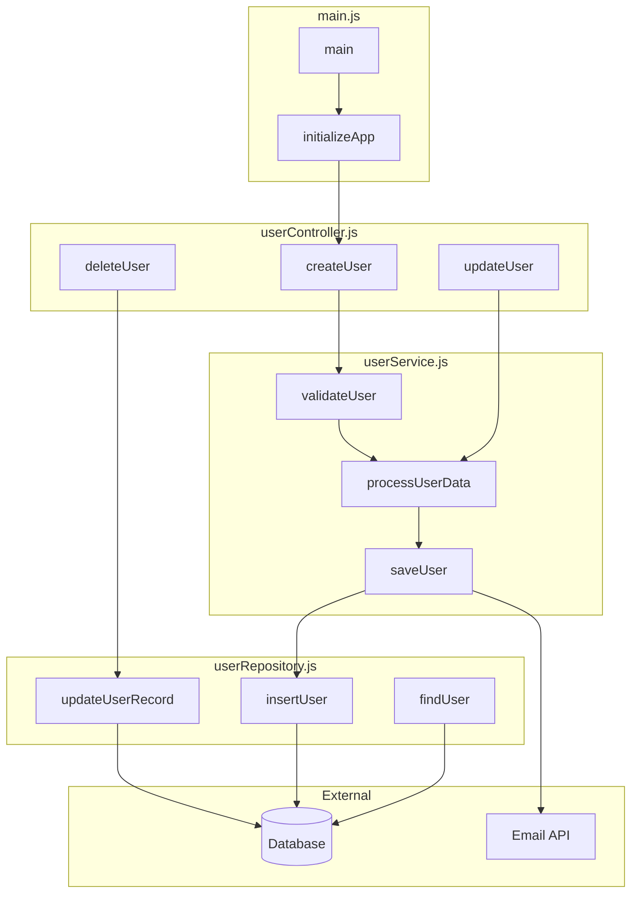

# Documentation Instructions

## Overview
Your task is to analyze this codebase and generate comprehensive, LLM-friendly documentation that makes the repository easily understandable to both humans and AI systems.

## Phase 1: Codebase Analysis

### 1.1 Repository Structure Analysis
- Scan the entire codebase recursively
- Create a hierarchical map of all directories and files
- Identify the primary programming language(s) and frameworks used
- Detect configuration files, build scripts, and deployment files
- Note any existing documentation files and their coverage

### 1.2 Technical Pattern Recognition
Analyze and document the following patterns:
- **Architecture Pattern**: MVC, microservices, monolith, etc.
- **Design Patterns**: Observer, Factory, Singleton, etc. used in the code
- **Data Flow**: How data moves through the application
- **Error Handling**: Exception patterns and error propagation
- **Testing Strategy**: Unit tests, integration tests, testing frameworks
- **Dependencies**: External libraries and their usage patterns
- **Configuration Management**: Environment variables, config files
- **Authentication/Authorization**: Security patterns if present

### 1.3 Code Structure Analysis
For each file, identify:
- Primary purpose and responsibility
- Key classes, functions, or modules exported
- Dependencies (imports/requires)
- External API calls or database interactions
- Side effects and state modifications

## Phase 2: Interactive Clarification

### 2.1 Ambiguity Resolution
When encountering unclear code, ask specific questions about:
- **Business Logic**: "What business rule does this complex conditional implement?"
- **Domain Context**: "What does 'reconciliation' mean in this business context?"
- **Edge Cases**: "Why does this function handle empty arrays differently?"
- **Performance Decisions**: "Why was this optimization chosen over simpler alternatives?"
- **Integration Points**: "How does this service communicate with external systems?"

### 2.2 Question Format
Structure questions as:
- File: `src/utils/parser.js`
- Function: `parseComplexData()` (lines 45-78)
- Line: 52-55
- Question: "This function has multiple nested transformations - what specific data format is being converted and why?"

**Additional Examples:**
- File: `src/services/payment.js`
- Function: `processRefund()` (lines 124-156)
- Line: 142
- Question: "Why does this conditional check for both `status === 'completed'` and `timestamp > cutoffDate`?"

- File: `src/models/user.js`
- Class: `UserModel` (lines 12-89)
- Line: 67-72
- Question: "What business rule does this complex validation logic implement for user creation?"

## Phase 3: Documentation Generation

### 3.1 Missing Docstrings/JSDoc
For functions without documentation, generate:
- **Purpose**: What the function does
- **Parameters**: Type, description, constraints, examples
- **Return Value**: Type, description, possible states
- **Side Effects**: Database writes, API calls, state changes
- **Throws/Errors**: Exception types and conditions
- **Usage Example**: Simple code example
- **Related Functions**: Dependencies and callers

**JavaScript/TypeScript Example:**
```javascript
/**
 * Processes user payment data and updates account balance
 * @param {Object} paymentData - Payment information object
 * @param {string} paymentData.userId - Unique user identifier
 * @param {number} paymentData.amount - Payment amount in cents
 * @param {string} paymentData.currency - ISO currency code (e.g., 'USD')
 * @returns {Promise<{success: boolean, transactionId: string, newBalance: number}>} 
 *   Payment processing result with transaction details
 * @throws {ValidationError} When payment data is invalid
 * @throws {InsufficientFundsError} When account balance is too low
 * @example
 * const result = await processPayment({
 *   userId: 'user123',
 *   amount: 2500, // $25.00
 *   currency: 'USD'
 * });
 */
```

**Python Example:**
```python
def process_payment(payment_data: dict) -> dict:
    """
    Processes user payment data and updates account balance.
    
    This function validates payment information, processes the transaction
    through the payment gateway, and updates the user's account balance
    in the database.
    
    Args:
        payment_data (dict): Payment information containing:
            - user_id (str): Unique user identifier
            - amount (int): Payment amount in cents  
            - currency (str): ISO currency code (e.g., 'USD')
            - payment_method (str): Payment method type ('card', 'bank_transfer')
    
    Returns:
        dict: Payment processing result containing:
            - success (bool): Whether payment was successful
            - transaction_id (str): Unique transaction identifier
            - new_balance (int): Updated account balance in cents
            - timestamp (str): ISO timestamp of transaction
    
    Raises:
        ValidationError: When payment data is invalid or incomplete
        InsufficientFundsError: When account balance is too low
        PaymentGatewayError: When external payment service fails
        
    Example:
        >>> result = process_payment({
        ...     'user_id': 'user123',
        ...     'amount': 2500,  # $25.00
        ...     'currency': 'USD',
        ...     'payment_method': 'card'
        ... })
        >>> print(result['success'])
        True
        
    Note:
        All monetary amounts are handled in cents to avoid floating-point
        precision issues. The function is idempotent for duplicate requests
        within a 5-minute window.
    """
```

### 3.2 Repository Documentation Files
Create the following markdown files with comprehensive structure:

#### `README.md` - Primary Project Documentation
**Structure should include:**

**1. Introduction & Business Domain**
- Brief project overview and purpose
- Business domain context and key concepts
- Core entities and their relationships
- Key metrics and business value

**2. Technology Stack**
- Runtime environment and versions
- Primary frameworks and libraries
- Database systems and storage
- Authentication and security
- Caching and performance tools
- Development tools and containerization

**3. Architecture Overview**
- Layered architecture description
- Visual architecture diagram (Mermaid)
- Data flow description
- Function call topology diagram (Mermaid)
- Key architectural components
- Database architecture and routing

**4. Project Structure**
- Complete directory tree with descriptions
- File organization principles
- Module boundaries and responsibilities
- Domain-driven structure explanation

**5. Naming Conventions & Patterns**
- API endpoint naming patterns
- Code organization patterns
- Database naming conventions
- Error handling patterns
- Use case implementation patterns

**6. Local Development Guide**
- Prerequisites and setup steps
- Development environment options
- Development commands reference
- Testing commands
- Package management workflow (for projects using Poetry, npm, yarn, pnpm, etc.)

**Example Package Management Section Structure:**
```markdown
**Package Management:**

To add/update/delete packages, use [npm/yarn/pnpm]. Always ensure lock files are committed to version control.

**Local Development:**
npm install package-name
npm install --save-dev dev-package-name

**Container Development:**
docker exec -it container_name bash
cd /app
npm install
```

**7. Environment Variables & Configuration**
- Environment-specific configuration approaches
- Required environment variables table
- Sample configuration files
- Environment-specific behavior differences

**8. Docker Configuration**
- Docker build arguments
- Multi-stage build targets
- Container environment variables
- Container runtime configuration

**9. Git Branch Management & Deployment**
- Branch workflow diagram (ASCII or Mermaid)
- Branch hierarchy and rules
- Deployment pipeline stages
- Environment mapping
- Best practices and commands

**10. API Usage Examples**
- Endpoint organization and patterns
- Request/response examples
- Authentication examples
- Error handling examples

**11. Performance Considerations**
- Query optimization patterns
- Caching strategies
- Response optimization
- Scalability considerations

#### `CLAUDE.md` - LLM-Specific Guidance
**Essential for AI code assistants:**

**1. Project Overview**
- Business domain in AI-friendly language
- Technology stack with versions
- Key architectural concepts

**2. Development Commands**
- Complete setup instructions
- Testing and validation commands
- Container development commands
- Package management workflow

**3. Architecture Overview**
- Clean data flow description
- Key architectural components
- Project structure with detailed descriptions

**4. Naming Conventions & Patterns**
- API patterns with examples
- Code organization patterns
- Database patterns
- Standard implementation patterns

**5. API Usage Patterns**
- Complete endpoint examples
- Request/response patterns
- Authentication patterns

**6. Implementation-Specific Patterns**
- Domain-specific implementation details
- Data transformation patterns
- Use case patterns with code examples
- Schema patterns with examples

**7. Environment Configuration**
- Environment variable reference
- Configuration by environment
- Deployment processes
- Environment-specific behavior

**8. Git Branch Management**
- Complete workflow description
- Branch commands reference
- Deployment pipeline details

**9. Dependencies & Tools**
- Core runtime dependencies
- Development tools
- Package management workflow (Poetry/npm/etc.)
- Version management approach
- Container vs. local dependency handling

**10. Important Implementation Notes**
- Configuration requirements
- Data access patterns
- Development workflow
- Performance patterns

#### Supporting Documentation Files

**`ARCHITECTURE.md` (if complex)**
- Detailed system architecture
- Component interactions
- Design decisions and rationale
- External system integrations

**`API_REFERENCE.md` (if API-heavy)**
- Complete endpoint documentation
- Authentication details
- Rate limiting and usage
- SDK examples

**`DEPLOYMENT.md` (if complex)**
- Infrastructure requirements
- Deployment procedures
- Monitoring and logging
- Scaling considerations

### 3.3 Critical Documentation Elements

#### Environment Variables Documentation
**Always include comprehensive environment variable documentation:**

**Table Format:**
| Variable | Description | Required | Default | Example |
|----------|-------------|----------|---------|---------|
| `API_STAGE` | Deployment environment | Yes | `dev` | `local`, `dev`, `prod` |

**Environment-Specific Configuration:**
- Development: `.env` file usage
- Production: ConfigMap, secrets, or environment-specific deployment
- Container: Internal container variables
- Behavior differences by environment

#### Docker Configuration Documentation
**Document Docker build and runtime configuration:**

**Build Arguments Table:**
| Argument | Description | Default | Example |
|----------|-------------|---------|---------|
| `NODE_VERSION` | Node.js version | `18` | `20` |

**Build Stages:**
- Development vs. production targets
- Multi-stage build benefits
- Container optimization strategies

**Package Manager Specific Examples:**
```dockerfile
# Node.js with npm
ARG NODE_VERSION=18
FROM node:${NODE_VERSION}-alpine AS base
WORKDIR /app
COPY package*.json ./
RUN npm ci --only=production

# Python with Poetry
ARG POETRY_VERSION=1.6.0
FROM python:3.11-slim AS base
ENV POETRY_HOME="/opt/poetry"
RUN pip install poetry==$POETRY_VERSION
COPY pyproject.toml poetry.lock ./
RUN poetry install --no-root --only=production
```

#### Git Branch Management
**Document complete branching strategy:**
- Branch hierarchy and flow
- Environment mapping
- Deployment processes
- CI/CD pipeline integration
- Manual vs. automated deployments

#### API Documentation Patterns
**For API-heavy projects, include:**
- Complete endpoint examples with curl commands
- Authentication patterns and examples
- Request/response schemas
- Error handling examples
- Rate limiting and usage guidelines

#### Performance & Scaling Documentation
**Include operational considerations:**
- Database query optimization patterns
- Caching strategies and TTL settings
- Performance monitoring approaches
- Scaling considerations and bottlenecks

#### Dependency Management Documentation
**For projects using package managers (Poetry, npm, etc.):**

**Package Management Workflow:**
- Clear steps for adding/updating/removing dependencies
- Environment-specific instructions (local vs. container)
- Lock file management and regeneration
- Version compatibility requirements

**Example for Poetry (Python):**
```bash
# Package Management Workflow:
# Step 1: Update package specifications in pyproject.toml
# Step 2: Install dependencies
poetry install

# For Container Development:
docker exec -it container_name bash
cd $PYSETUP_PATH
poetry install
```

**Example for npm/yarn (Node.js):**
```bash
# Package Management Workflow:
# Step 1: Add/update dependencies
npm install package-name
# or for dev dependencies
npm install --save-dev package-name

# Update existing dependencies
npm update

# For Container Development:
docker exec -it container_name bash
cd /app
npm install

# Alternative with yarn:
yarn add package-name
yarn add --dev package-name
yarn upgrade
```

**Example for pnpm (Node.js):**
```bash
# Package Management Workflow:
pnpm add package-name
pnpm add --save-dev package-name
pnpm update

# For Container Development:
docker exec -it container_name bash
cd /app
pnpm install
```

**Container vs. Local Development:**
- Distinguish between local and containerized dependency management
- Include container-specific paths and commands
- Document lock file synchronization between host and container

**Lock Files by Package Manager:**
- **Poetry**: `poetry.lock` - should be committed to version control
- **npm**: `package-lock.json` - should be committed to version control
- **yarn**: `yarn.lock` - should be committed to version control  
- **pnpm**: `pnpm-lock.yaml` - should be committed to version control

**Node.js Container Considerations:**
- Document `node_modules` volume mounting strategies
- Include `NODE_ENV` environment variable implications
- Address npm cache and permission issues in containers
- Document package manager selection consistency across environments

## Phase 4: Visual Documentation

### 4.1 Architecture Diagrams
Create Mermaid diagrams for:

**System Architecture:**


**Branch Workflow (when complex CI/CD):**
Follows Git Flow
```
main       ───●──────────────●───────────●────────►
              │             ╱           ╱
release/*  ───┼───────●────●           ●
              │      ╱      ╲         ╱
develop    ───●──●──●──●─────●───────●────────────►
              │         ╲           ╱  
feature/*  ───┼───●──●───●──●──────●    
              │                        
              └─ Initial commit
```

### 4.2 Function Call Topology Visualization
Create a Mermaid diagram showing:
- Function call relationships
- Module dependencies
- Data flow between components
- External service interactions

**Important**: Group functions from the same file into subgraphs to show file boundaries clearly.

Use this format:


**Subgraph Guidelines:**
- Use file names (with extension) as subgraph titles
- Include all functions from each file within their respective subgraphs
- Use descriptive function names, not generic labels
- Group external dependencies in an "External" subgraph
- Show both intra-file and inter-file function calls
- Use consistent node styling within subgraphs

### 4.2 Additional Diagrams
Consider creating:
- **Sequence Diagrams**: For complex workflows
- **Class Diagrams**: For OOP codebases
- **State Diagrams**: For stateful components
- **Deployment Diagrams**: For system architecture

## Phase 5: Validation and Refinement

### 5.1 Documentation Quality Check
Ensure each piece of documentation answers:
- **What**: What does this code do?
- **Why**: Why does it exist?
- **How**: How does it work?
- **When**: When is it called/used?
- **Where**: Where does it fit in the larger system?

### 5.2 Cross-Reference Validation
Verify that:
- Function calls match documented signatures
- Dependencies are accurately represented
- Data types are consistent across documentation
- Examples are executable and correct

## Output Format

Structure your response as:

1. **Analysis Summary**: Brief overview of codebase characteristics
2. **Clarification Questions**: Numbered list of specific questions
3. **Generated Documentation**: The actual markdown files and updated code files
4. **Visual Diagrams**: Mermaid code for topology and architecture
5. **Next Steps**: Recommendations for maintaining LLM-friendly documentation

## Phase 6: Documentation Maintenance Patterns

### 6.1 Documentation Update Triggers
Update documentation when:
- Adding new API endpoints or services
- Changing environment variables or configuration
- Modifying deployment processes
- Adding new dependencies or changing versions
- Implementing new architectural patterns
- Changing branching or CI/CD workflows

### 6.2 Documentation Validation Checklist
Before considering documentation complete, verify:

**README.md Completeness:**
- [ ] Business domain context is clear
- [ ] Technology stack includes versions
- [ ] Architecture diagrams show accurate relationships
- [ ] Environment variables are comprehensive with examples
- [ ] Docker configuration is fully documented
- [ ] Git workflow matches actual deployment process
- [ ] API examples are working and current
- [ ] Performance considerations are relevant
- [ ] Dependency management workflow is clearly documented for the specific package manager (Poetry/npm/yarn/pnpm)
- [ ] Package management distinguishes between local and container development
- [ ] Lock file management is documented (poetry.lock, package-lock.json, yarn.lock, pnpm-lock.yaml)
- [ ] Container-specific dependency considerations are addressed (node_modules mounting, npm cache, etc.)

**CLAUDE.md LLM-Friendliness:**
- [ ] Development commands are copy-pastable
- [ ] Implementation patterns include code examples
- [ ] Environment behavior differences are explicit
- [ ] Branch management commands are specific
- [ ] Dependencies list includes why they're needed
- [ ] Configuration requirements are unambiguous
- [ ] Package management workflow is step-by-step clear
- [ ] Container dependency commands include proper paths

**Cross-Reference Consistency:**
- [ ] Environment variables match between README and CLAUDE
- [ ] Docker stages align with deployment descriptions
- [ ] API examples work with documented authentication
- [ ] Branch names match CI/CD configuration

### 6.3 Best Practices from Successful Projects

#### Environment Configuration Documentation
- Always distinguish between development (.env) and production (ConfigMap/secrets) configuration
- Include sample configuration files with realistic examples
- Document environment-specific behavior differences clearly
- Provide troubleshooting for common configuration errors

#### Docker Documentation Standards
- Document all build arguments with examples
- Explain multi-stage build rationale
- Include container runtime behavior differences
- Document internal vs. user-configurable environment variables

#### API Documentation Excellence
- Provide working curl examples for all endpoints
- Include both successful and error response examples
- Document authentication clearly with real token examples (sanitized)
- Show request/response schemas with actual data types

#### Branch Management Documentation
- Use ASCII diagrams for compatibility when Mermaid isn't supported
- Include specific git commands for each workflow step
- Map branches to deployment environments clearly
- Document manual vs. automated deployment triggers

#### Architecture Documentation Patterns
- Layer diagrams should show data flow direction
- Use consistent terminology throughout documentation
- Include external service dependencies in architecture diagrams
- Show both high-level architecture and detailed function call topology

#### Dependency Management Documentation Standards
- Always document the complete workflow: update specification → install dependencies
- Distinguish between local development and container development approaches
- Include version requirements and compatibility notes
- Document lock file management and regeneration procedures
- Provide container-specific paths and commands when applicable
- Explain when to run commands inside containers vs. on host

**Technology-Specific Patterns:**

**Python (Poetry) Projects:**
- Document `pyproject.toml` → `poetry install` workflow
- Include `poetry lock` file management
- Container path variables (`$PYSETUP_PATH`, `$VENV_PATH`)
- Virtual environment activation patterns

**Node.js Projects:**
- Document package manager choice (npm/yarn/pnpm) consistently
- Include lock file synchronization (`package-lock.json`, `yarn.lock`, `pnpm-lock.yaml`)
- Address `node_modules` volume mounting in containers
- Document `NODE_ENV` environment implications (development vs. production installs)
- Include npm cache and permission solutions for containers

## Success Criteria

The documentation should enable an LLM to:
- Understand the codebase structure without exploring files
- Make accurate code modifications with proper context
- Explain functionality to developers
- Identify potential issues or improvements
- Generate new code that follows existing patterns
- Set up development environment from scratch
- Navigate deployment and configuration processes
- Understand business domain context for better code decisions

## Documentation Success Indicators

**For Human Developers:**
- New team members can set up development environment in under 30 minutes
- API integration is possible using only the documentation
- Deployment process is executable following the documented steps
- Business domain context is clear enough for code review decisions

**For AI Code Assistants:**
- Can implement new features following established patterns
- Understands configuration and environment management
- Can troubleshoot common development and deployment issues
- Makes informed architectural decisions consistent with existing patterns
- Generates appropriate tests following documented testing strategies
